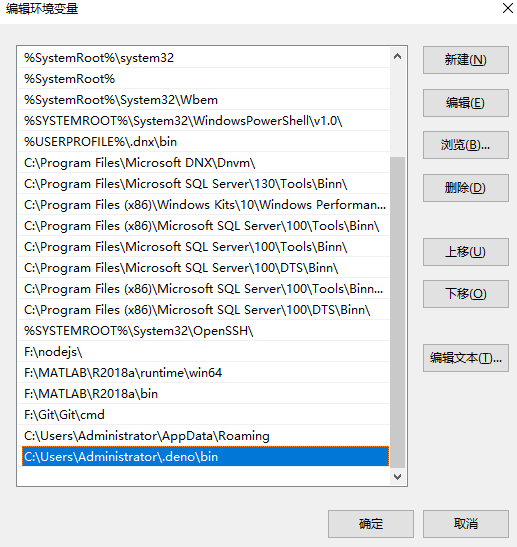

# Pagic安装和使用
Pagic 是基于Deno实现的，所以使用前需要先安装Deno。

## 1. 安装Deno [不同系统]
######Shell (Mac, Linux):
```
curl -fsSL https://deno.land/x/install/install.sh | sh
```
######PowerShell (Windows):
```
iwr https://deno.land/x/install/install.ps1 -useb | iex
```
######Homebrew (Mac):
```
brew install deno
```
######Chocolatey (Windows):
```
choco install deno
```
######Scoop (Windows):
```
scoop install deno
```

## 2. 安装 Pagic
执行以下命令来安装最新版本的 Pagic：
```
deno install --unstable --allow-read --allow-write --allow-net --allow-run --name=pagic https://deno.land/x/pagic/mod.ts
```

若需要安装指定版本的 Pagic，则可以在安装的 URL 中加入版本号：
```
deno install --unstable --allow-read --allow-write --allow-net --allow-run --name=pagic https://deno.land/x/pagic@v1.3.1/mod.ts
```

## 3. 初始化项目
要使用 pagic 构建静态网站，则该项目至少需要包含一个 pagic.config.ts 配置文件和一个 md/tsx 页面文件：
#####新建如下目录文件：
```
site/
├── pagic.config.ts
└── README.md
```
其中 pagic.config.ts 一开始可以只导出一个空对象：```export default {};```
README.md 可以是一个简单的 Markdown 文件：```# Hello world```

## 4. 运行 pagic build
windows操作系统在此之前需要配置环境变量：在Path中配置添加```C:\Users\Administrator\.deno\bin```


在 site 目录下运行以下代码：
```
pagic build --watch --serve
```
在览器打开 http://127.0.0.1:8000/ ，显示出README.md中的Hello world


#####build构建结果在dist目录中
```
site/
|── dist    # 构建结果目录
|   └── index.html
├── pagic.config.ts
└── README.md
```
